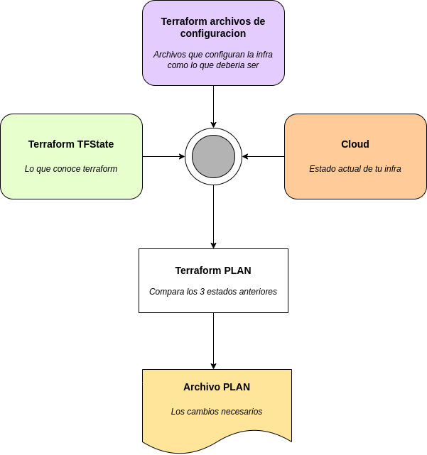
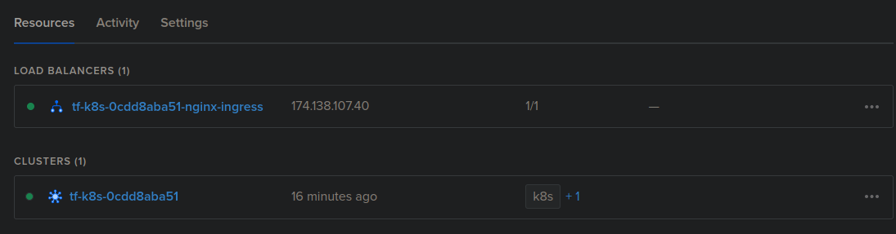

## Terraform
Tres pasos del workflow:
1. init
2. plan
3. apply

### Init

`terraform init` crea un lock llamado terraform.lock.hcl e inicializando el archivo de backend, plugins, etc...

### Plan

Compara los archivos de configuracion, el terraform tfstate, y el actual estado del cloud. Esquema:



Usando el -o(output) generamos el archivo
```
terraform plan --out tfplan.bin
```

Visualizar el plan en formato json

```
terraform show -json tfplan.bin | jq '.' > tfplan.json
```

### Apply

Ultimo paso, aplicar

con `-auto-approve` elimina la necesidad de interaccion, no es recomendable. Si se utiliza en entornos de automatizacion, usar el apply sobre merges/aproved pull-request manuales.

Listado de operaciones que se realizaran `Plan: 2 to add, 5 to change, 4 to destroy.`:
- Add: los nuevos recursos que se añadiran a tu infra
- Change: recursos existentes que cambiaran en tu infra
- Destroy: recursos existentes que se borraran en tu infra


## github self hosted runner

- diferentes runners segun el entorno: https://jonico.github.io/awesome-runners/
- aspectos de seguridad: https://github.com/dduzgun-security/github-self-hosted-runners

Link directo a los runners:
https://github.com/sosan/TU_REPO/actions/runners

Esta en Settings -> Actions/Runners

click boton New self hosted runner
copiamos el token del self runner AAPYBGPKQ3UMKEO5QECBGC3CXCH4I(ejemplo)


En el vps, tenemos montado un docker sin rootless (TODO: rootless)
> NOTA: si seguimos las instrucciones del github, se ejecutara un runner, y cuando queramos borrarlo podemos ir al github y click boton borrar y se borraran los servicios del vps referentes al github runner

usando imagen https://hub.docker.com/r/myoung34/github-runner

Config basica runner:

```
docker run -d --restart always --name github-runner \
  -e REPO_URL="https://github.com/sosan/github-self-runner-digitalocean" \
  -e RUNNER_NAME="linux-terraform" \
  -e RUNNER_TOKEN="AAPYBGPKQ3UMKEO5QECBGC3CXCH4I" \
  -e RUNNER_WORKDIR="/tmp/github-self-runner-digitalocean" \
  -v /tmp/github-self-runner-digitalocean:/tmp/github-self-runner-digitalocean \
  -v /var/run/docker.sock:/var/run/docker.sock \
  myoung34/github-runner:latest 
```
```
docker logs github-runner
```

muestra:
```
# Authentication
√ Connected to GitHub
# Runner Registration
√ Runner successfully added
√ Runner connection is good
# Runner settings
√ Settings Saved.
√ Connected to GitHub
Current runner version: '2.294.0'
2022-06-26 15:58:21Z: Listening for Jobs
```
en el github seccion actions/runners tendria que poner idle

mas info:
https://docs.github.com/en/actions/hosting-your-own-runners/adding-self-hosted-runners#adding-a-self-hosted-runner-to-a-repository


Desde github añadimos un token llamado: `DIGITALOCEAN_ACCESS_TOKEN` con el PAT de digitalocean

DIGITALOCEAN_ACCESS_TOKEN=dop_v1_d8eeed703665XXXXXXXXXXX18d0021319XXXXXXXXX(ejemplo)

Imagen despliegue:

